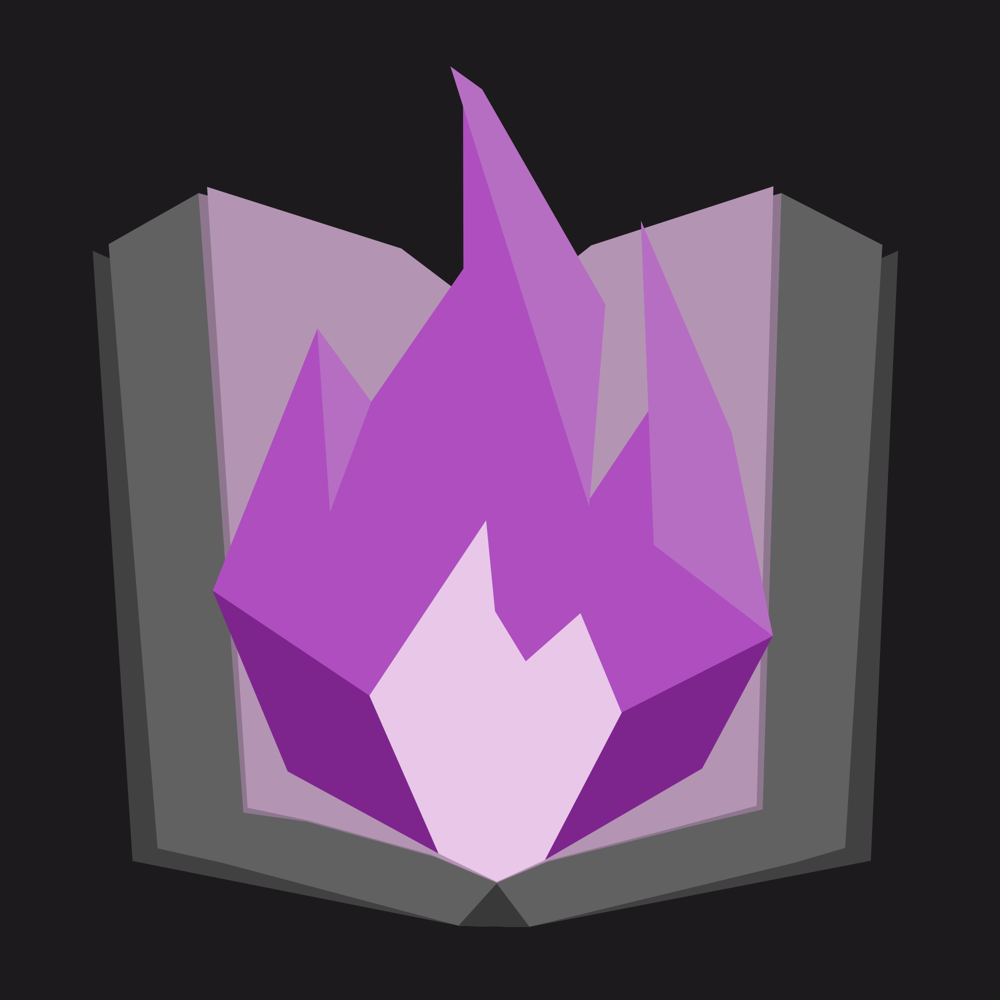

# Rekindle

Rekindle is a self-hosted comic, manga, and book server with clients for Linux, Windows, and Android.

Run the server on any machine that holds your archive files. Connect from any device running the client, browse your libraries, read in the browser-free native reader, and download issues for offline use. Multiple users are supported, each with their own reading progress and permission level.

> **Disclaimer:** Rekindle is intended for use with content you own or have the legal right to access. The developers are not responsible for any misuse.

<p align="center">
  
</p>


---

## Downloads

| Platform | Where to get it |
|----------|----------------|
| Server (Linux / Windows) | [GitHub Releases](https://github.com/Jombolio/rekindle/releases) |
| Client — Linux | [GitHub Releases](https://github.com/Jombolio/rekindle/releases) |
| Client — Windows | [GitHub Releases](https://github.com/Jombolio/rekindle/releases) |
| Client — Android | F-Droid · custom repo: `https://fdroid.jombo.uk/repo` |

---

## Documentation

Full guides, configuration reference, and FAQ are on the **[GitHub Wiki](https://github.com/Jombolio/rekindle/wiki)**.

| Page | |
|------|-|
| [Installing the Server](https://github.com/Jombolio/rekindle/wiki/Installing-the-Server) | Linux and Windows |
| [Installing the Client](https://github.com/Jombolio/rekindle/wiki/Installing-the-Client) | Linux, Windows, Android (F-Droid) |
| [First Connection & Setup](https://github.com/Jombolio/rekindle/wiki/First-Connection-and-Setup) | Add a server, create the admin account, set up a library |
| [Configuration](https://github.com/Jombolio/rekindle/wiki/Configuration) | Ports, paths, JWT secrets |
| [HTTPS](https://github.com/Jombolio/rekindle/wiki/HTTPS) | Caddy, Nginx, or Kestrel direct TLS |
| [Metadata APIs](https://github.com/Jombolio/rekindle/wiki/Metadata-APIs) | ComicVine, MyAnimeList, AniList |
| [FAQ](https://github.com/Jombolio/rekindle/wiki/FAQ) | Common questions and troubleshooting |

---

## Supported Formats

`.cbz` · `.cbr` · `.epub` · `.mobi` · `.pdf`

---

## Building from Source

See [Building from Source](https://github.com/Jombolio/rekindle/wiki/Building-from-Source) on the wiki.

**Requirements:** .NET 10 SDK · Flutter SDK

```bash
# Server
cd server && dotnet run --project Rekindle.Server

# Client
cd desktop && flutter run
```
